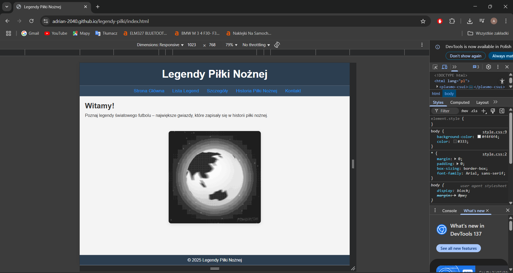
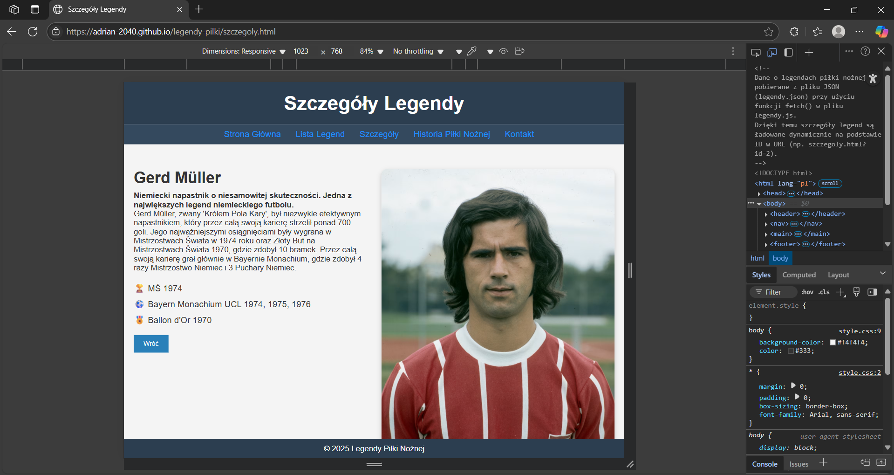
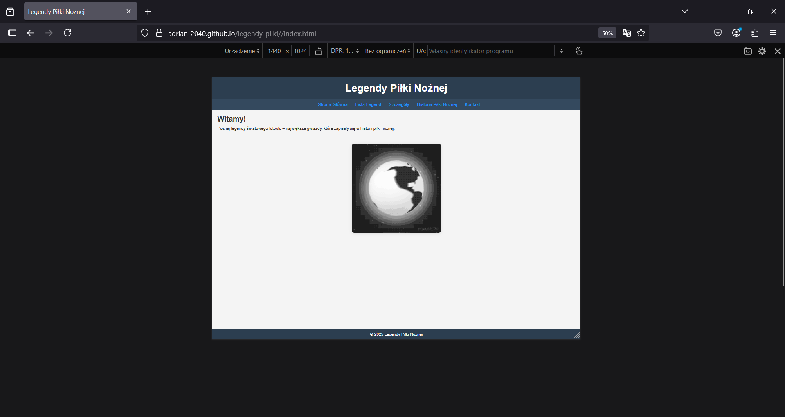
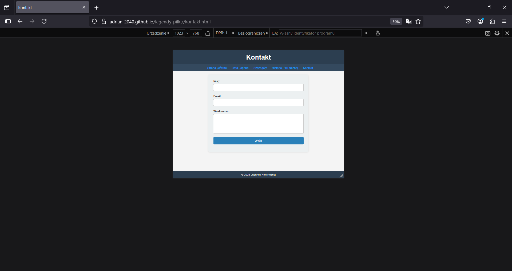
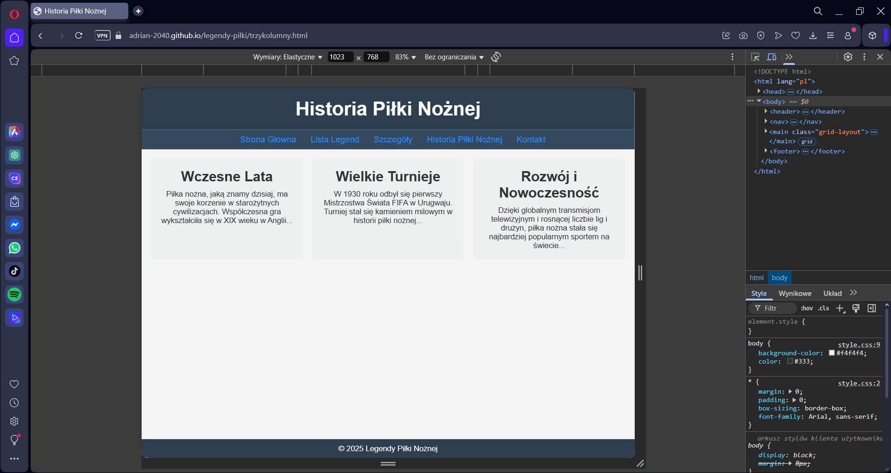

# Projektowanie Intersfejsów Użytkownika

# Adrian Irla

# "Legendy Piłki Nożnej"

## Wstęp

Projekt "Legendy Piłki Nożnej" to responsywna aplikacja internetowa prezentująca informacje o największych gwiazdach światowego futbolu. Aplikacja umożliwia przeglądanie, wyszukiwanie i filtrowanie legend piłki nożnej oraz poznawanie ich historii i osiągnięć.

## Opis struktury serwisu

### Struktura plików
```
projekt/
├── index.html          # Strona główna
├── lista.html          # Lista legend z funkcjami wyszukiwania
├── szczegoly.html      # Szczegółowe informacje o legendach
├── trzykolumny.html    # Historia piłki nożnej (layout 3-kolumnowy)
├── kontakt.html        # Formularz kontaktowy
├── style.css           # Główny plik stylów CSS
├── legendy.js          # Dane legend i logika aplikacji
├── legendy.json        # Dane legend w formacie JSON
├── kontakt.js          # Logika formularza kontaktowego
└── script.js           # Dodatkowe skrypty
```

### Architektura strony

#### Strona główna (index.html)
- Zawiera powitanie użytkownika
- Prezentuje animowaną grafikę piłki (pilka.gif)
- Stanowi punkt wejścia do aplikacji

#### Lista legend (lista.html)
- Wyświetla karty z legendami piłki nożnej
- Implementuje funkcje:
  - Wyszukiwanie po nazwie
  - Sortowanie alfabetyczne (A-Z, Z-A)
  - Filtrowanie po narodowości
  - Paginacja (4 elementy na stronę)

#### Szczegóły legend (szczegoly.html)
- Prezentuje szczegółowe informacje o wybranej legendzie
- Zawiera zdjęcie, biografię i osiągnięcia
- Wykorzystuje parametry URL do identyfikacji legendy

#### Historia piłki nożnej (trzykolumny.html)
- Layout 3-kolumnowy prezentujący historię futbolu
- Responsywny design dopasowujący się do różnych rozdzielczości

#### Kontakt (kontakt.html)
- Formularz kontaktowy z walidacją
- Pola: imię, email, wiadomość

## Opis technologii zastosowanych przy tworzeniu serwisu

### Frontend
- **HTML5**: Semantyczna struktura dokumentu
- **CSS3**: Stylizacja z wykorzystaniem:
  - CSS Grid i Flexbox dla responsywnego layoutu
  - Media queries dla różnych rozdzielczości
  - Animacje i efekty hover
  - Box-shadow dla efektów wizualnych

### JavaScript
- **Vanilla JavaScript**: Logika aplikacji bez zewnętrznych bibliotek
- **DOM Manipulation**: Dynamiczne tworzenie i modyfikowanie elementów
- **Event Listeners**: Obsługa interakcji użytkownika
- **Local Storage**: Zapamiętywanie ostatnio oglądanej legendy
- **URL Parameters**: Przekazywanie danych między stronami
- **Fetch API**: Pobieranie danych z pliku JSON (w script.js)

### Struktury danych
- **JSON**: Format przechowywania danych o legendach
- **JavaScript Objects**: Reprezentacja danych w aplikacji

### Funkcjonalności
1. **Wyszukiwanie tekstowe**: Filtrowanie legend po nazwie i opisie
2. **Sortowanie**: Alfabetyczne uporządkowanie wyników
3. **Filtrowanie**: Selekcja według narodowości
4. **Paginacja**: Podział wyników na strony
5. **Responsywność**: Dostosowanie do różnych rozdzielczości ekranu
6. **Nawigacja**: Spójny system nawigacji między stronami

## Testy

### Testy funkcjonalności

#### Test wyszukiwania
- **Scenariusz**: Wpisanie nazwy legendy w pole wyszukiwania
- **Rezultat**: Wyświetlenie pasujących wyników

#### Test sortowania
- **Scenariusz**: Zmiana opcji sortowania z listy rozwijanej
- **Rezultat**: Reorganizacja wyników według wybranego kryterium

#### Test filtrowania
- **Scenariusz**: Wybór narodowości z listy filtrów
- **Rezultat**: Wyświetlenie tylko legend z wybranego kraju

#### Test paginacji
- **Scenariusz**: Nawigacja między stronami wyników
- **Rezultat**: Wyświetlenie 4 elementów na stronę

#### Test szczegółów legendy
- **Scenariusz**: Kliknięcie w link "Zobacz szczegóły"
- **Rezultat**: Przejście do strony z pełnymi informacjami

### Testy rozdzielczości na przeglądarkach

#### Chrome
- **Desktop - Desktop - 1440x1024** 


- **Tablet - 1023x768** 



- **Mobile - 375x767** 


#### Firefox
- **Desktop - 1440x1024** 


- **Tablet - 1023x768** 





- **Mobile - 375x767** 


#### Edge
- **Desktop - 1440x1024** 



- **Tablet - 1023x768** 



- **Mobile - 375x767** 


#### Opera
- **Desktop - 1440x1024** 


- **Tablet - 1023x768** 




- **Mobile - 375x767** 


#### Safari
### Brak możliwości testowania na przeglądarce Safari

## Podsumowanie

Projekt "Legendy Piłki Nożnej" to w pełni funkcjonalna aplikacja webowa spełniająca założone cele. Aplikacja cechuje się:

### Mocne strony
- **Responsywny design** dostosowujący się do różnych urządzeń
- **Intuicyjny interfejs** użytkownika
- **Bogate funkcjonalności** wyszukiwania i filtrowania
- **Czysty, semantyczny kod** HTML
- **Dobra organizacja** plików i struktury
- **Wysoka kompatybilność** z przeglądarkami